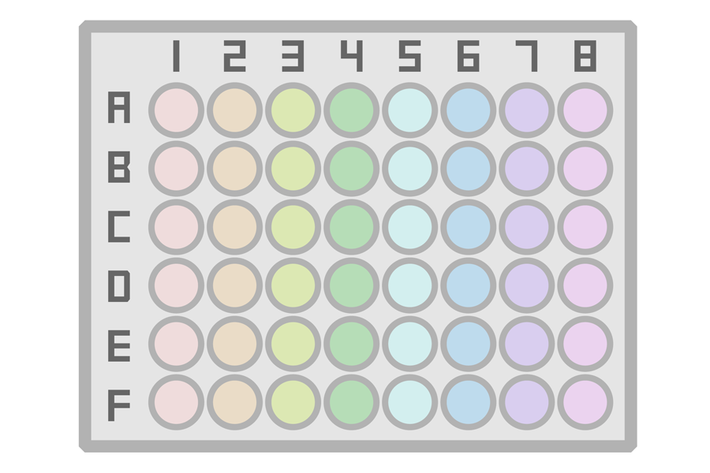
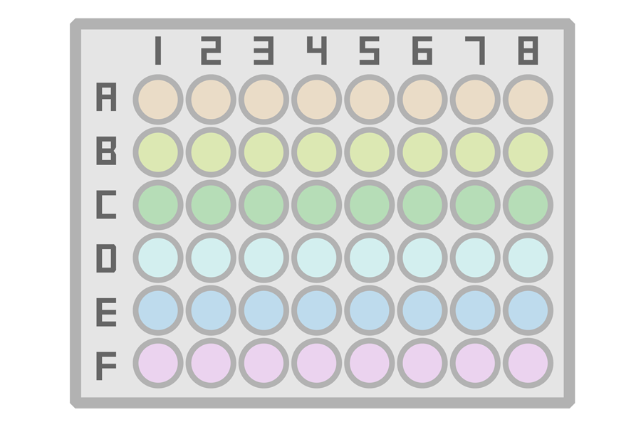
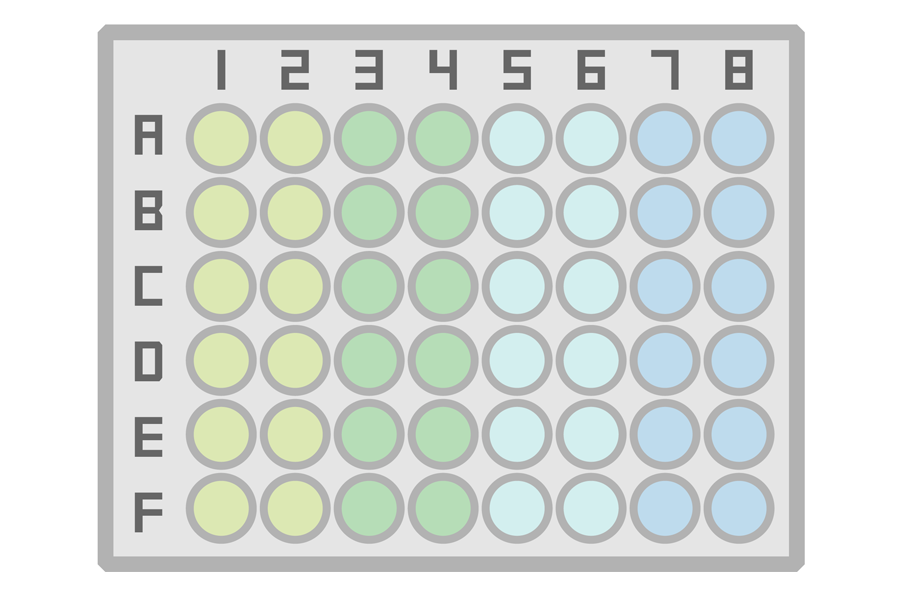
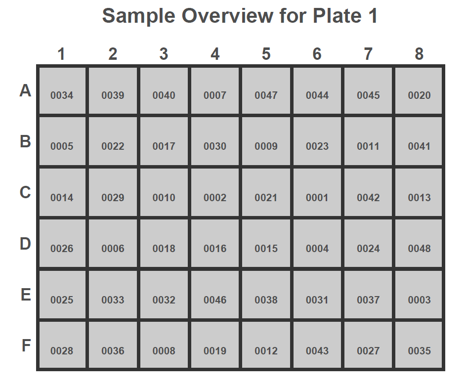
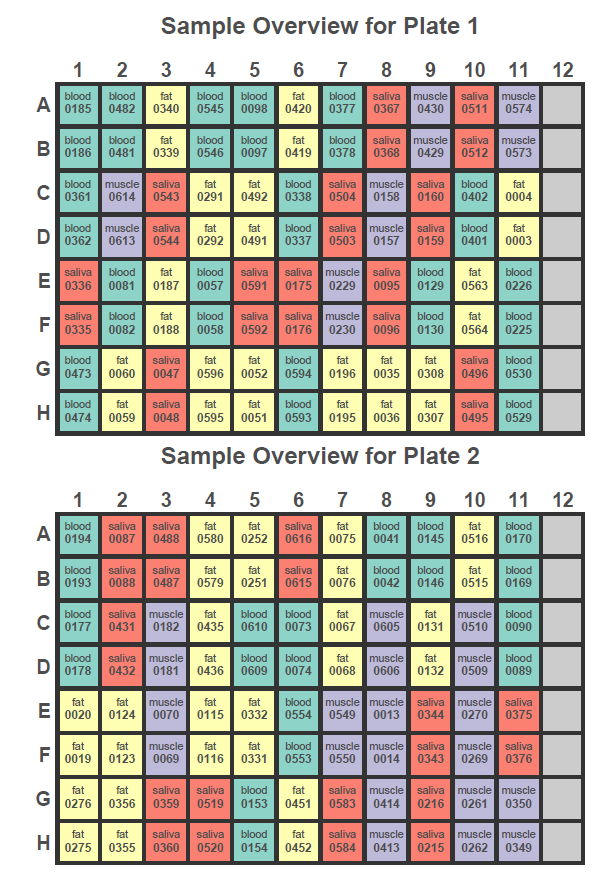

```{r setup, include=FALSE}
knitr::opts_chunk$set(collapse=TRUE, comment="#>")
set.seed(123)
```

# Introduction #

Batch effects can have a major impact on the results of omics studies 
[@Leek2010]. Randomization is the first, and arguably most influential, step 
in handling them. However, its implementation suffers from a few key issues:

* A single random draw can inadvertently result in high correlation between
technical covariates and biological factors. Particularly in studies with 
large numbers of batches and outcomes of interest, minimizing these 
correlations is crucial. 
* Long, randomized sample lists are unintuitive and translate poorly into any 
wet lab that is not fully automated. This can result in errors and sample 
mixups.
* The randomization process is inherently unclear in many publications, rarely 
described despite the varying efficacy of methods.
* Randomized layouts are not always reproducible, resulting in inconsistent 
results.

To combat these problems, we developed **Omixer** - an R package for 
multivariate randomization and reproducible generation of intuitive sample 
layouts.

## Dependencies ##

This document has the following dependencies.

```{r loadPackages, warning=FALSE, message=FALSE}
library(Omixer)
library(tibble)
library(forcats)
library(stringr)
library(dplyr)
library(ggplot2)
library(magick)
```

## Workflow ##

**Omixer** randomizes input sample lists multiple times (default: 1,000) and 
then combines these randomized lists with plate layouts, which can be selected 
from commonly used setups or custom-made. It can handle paired samples, 
keeping these adjacent but shuffling their order, and allows explicit masking 
of specific wells if, for example, plates are shared between different studies.

After performing robust tests of correlation between technical covariates and 
selected randomization factors, a layout is chosen using these criteria:

* No test provided sufficient evidence to suggest correlation between the 
variables (all p-values over 0.05).
* From the remaining layouts, return one where the absolute sum of 
correlations is minimized.

The optimal randomized list can then be processed by `omixerSheet`, returning 
intuitive sample layouts for the wet lab.

# Creating Layouts #

In order to establish correlations between technical covariates and biological 
factors, **Omixer** needs to know the plate layout that your samples will be 
randomized to. There are several options for automatically creating some 
common layouts. Alternatively, a data frame can be input to the `layout` 
option alongside specified `techVars`. Possibilities are discussed in more 
detail below.

## Automated Layouts ##

Several options can be used to automatically generate common layouts:

* `wells` specifies the number of wells on a plate, which can be 96, 48, or 24.
* `plateNum` determines how many copies of the plate your samples will need.
* `div` is optional, and subdivides the plate into batches. This can be used 
to specify chips within a plate, for example.
* `positional` allows positions within `div` to also be treated as batches. 
This is useful for 450K experiments where positional batch effects have been 
identified [@Jiao2018].

## Subdivisions ###

By default, `div` is set to "none", but it can be set to "col", "row", 
"col-block", or "row-block". 

* `col` treats each column in the plate as a batch
* `row` treats each row in the plate as a batch
* `col-block` will separate the plate into batches that are 2 columns wide
* `row-block` separates the plate into 2 row wide batches

So, for `wells=48, div="col"`, each column of a 48-well plate will be 
treated as a batch (different colours in the image below).

```{r echo=FALSE, out.width='100%'}

```

If you instead specify `div="row"`, the rows will be treated as batches. 

```{r echo=FALSE, out.width='100%'}

```

Similarly, you can set `div="col-block"` or `div="row-block"` for 
batches that are 2 columns or rows wide, respectively. The image below shows 
how a 48 well plate would be subdivided with the `div="col-block"` option.

```{r echo=FALSE, out.width='100%'}

```

Combining the above will allow you to create a large number of layouts 
commonly used in omics experiments. 

## Masking ##

If your experiment requires certain wells to be left empty, then these can be 
specified with the `mask` option. By default, no wells are masked, but you can 
specify masking, with `1` representing a masked well and `0` signifying that a 
sample should be randomized to this position.

Wells are numbered along each row sequentially. In the images above, row A 
includes wells 1 through 8, row B is wells 9 to 16, and so on until well 48 at 
F8.

## Custom Layouts ##

If none of the automated layouts represent your setup you can input your own 
plate layout as a data frame. The only requirement is that the number of 
unmasked wells is equal to the number of samples in your experiment, and that 
you input the names of technical covariate columns to the `techVars` option. 

For example, if we wanted to create a 96-well plate to send for 450K DNA
methylation profiling, we might submit the following `layout` and `techVars`.

```{r}
layout <- tibble(plate=rep(1, 96), well=1:96, 
    row=factor(rep(1:8, each=12), labels=toupper(letters[1:8])),
    column=rep(1:12, 8), chip=as.integer(ceiling(column/2)),
    chipPos=ifelse(column %% 2 == 0, as.numeric(row)+8, row))

techVars <- c("chip", "chipPos")

layout
```


# Simple example #

We create toy data, representing 48 samples to be sent off for RNA sequencing. 
All samples will be on a single 48-well flowcell, with each of the 8-sample 
rows being pipetting onto a lane, resulting in 6 lanes. This setup can be 
represented using provided **Omixer** layouts, as is described below.

First, we build the sample list that will be provided to **Omixer**, with 
information on the age, sex, and smoking status of individuals alongside 
sample isolation dates. We want to optimize distribution of these randomization
variables across lanes on the flowcell to minimize batch effects.

```{r rna_toy_data}
sampleList <- tibble(sampleId=str_pad(1:48, 4, pad="0"),
    sex=as_factor(sample(c("m", "f"), 48, replace=TRUE)), 
    age=round(rnorm(48, mean=30, sd=8), 0), 
    smoke=as_factor(sample(c("yes", "ex", "never"), 48, 
        replace=TRUE)),
    date=sample(seq(as.Date('2008/01/01'), as.Date('2016/01/01'), 
        by="day"), 48))

sampleList
```

## Randomization Variables ##

Using the `randVars` option, we inform **Omixer** which columns in our data 
represent randomization variables. You can specify any number of variables, 
but with increasing numbers it will become more difficult to optimize their 
distribution across batches. 

```{r rna_var_setup}
randVars <- c("sex", "age", "smoke", "date")
```

## Running **Omixer** ##

To perform multivariate randomization use the `omixerRand` function. For our 
example, we have one 96-well flowcell `wells=96, plateNum=1` and want to 
optimize sample distribution across lanes `div="row"`. 

Following randomization, `omixerRand` will display a visualization of 
correlations between randomization and technical variables. If the returning 
correlations are higher than you would like, you can increase the `iterNum` 
or decrease the number of randomization variables.  

```{r rna_omixer_rand}
omixerLayout <- omixerRand(sampleList, sampleId="sampleId", 
    block="block", iterNum=100, wells=48, div="row", 
    plateNum=1, randVars=randVars)
```

Following `omixerRand`, an optimal randomized sample list is returned. This 
can be used as is or processed by `omixerSheet` to create lab-friendly sample 
sheets, which will be shown below.

```{r}
head(omixerLayout[1:11])
```

## Regenerating Layouts ##

Since multivariate randomization can take some time with large datasets and 
many randomization variables, we provide the `omixerSpecific` function to 
reproduce previously generated layouts. After running `omixerRand`, the seed 
of the optimal layout is saved to the working directory.

After setting the global variable `.Random.seed`, you can run `omixerSpecific`
to regenerate the optimal layout.

```{r omixer_specific_rna, eval=FALSE}
load("randomSeed.Rdata")
.GlobalEnv$.Random.seed <- randomSeed

omixerLayout <- omixerSpecific(sampleList, sampleId="sampleId", 
    block="block", wells=96, div="row", 
    plateNum=1, randVars=randVars)
```

## Sample Sheets ##

Once the multivariate randomization is complete, the resulting data frame can 
be input into `omixerSheet` to produce lab-friendly sample layouts. These will 
be saved in your working directory as a PDF document. 

It is possible to colour code these sheets by a specific factor using the 
`group` option, and this is demonstrated in the extended example.

```{r omixer_sheet_rna}
omixerSheet(omixerLayout)
```


```{r echo=FALSE, out.width='100%'}

```

# Extended example #

To demonstrate the full functionality of **Omixer**, we present an extended 
example.

Here, our toy data represents 616 samples ready to be sent off for EPIC DNA 
methylation profiling. These samples will be randomized to 7 96-well plates 
where each of the 8 columns are transferred to a 12-sample EPIC chip. The 
last chip on each plate needs to be kept empty for control samples, and we 
will communicate this to **Omixer** using the `mask` option.

Our samples are taken from 4 different tissues of 77 individuals, and we are 
interested in how DNA methylation changes over 2 timepoints. Given our 
primary research question, we would like to keep the timepoints adjacent on 
the array but randomize their order. We can do this in **Omixer** with the 
`block` option, as demonstrated below.

## Creating Toy Data ##

As well as a sample ID, we need to tell **Omixer** which variables specify 
paired sample blocks using a blocking variable, which we name `block`.

```{r dna_toy_data}
sampleList<- tibble(sampleId=str_pad(1:616, 4, pad="0"), 
    block=rep(1:308, each=2), 
    time=rep(0:1, 308), 
    tissue=as_factor(rep(c("blood", "fat", "muscle", "saliva"), 
        each=2, 77)), 
    sex=as_factor(rep(sample(c("male", "female"), 77, replace=TRUE), 
        each=8)), 
    age=round(rep(rnorm(77, mean=60, sd=10), each=8), 0), 
    bmi=round(rep(rnorm(77, mean=25, sd=2), each=8) , 1), 
    date=rep(sample(seq(as.Date('2015/01/01'), as.Date('2020/01/01'), 
        by="day"), 77), each=8))

sampleList
save(sampleList, file="sampleList.Rdata")
```

## Setting up Variables ##

We set up our randomization variables to optimize distribution of our 
biological factors across chips and plates. Randomization variables in our 
example are tissue, sex, age, body mass index (BMI), and isolation date. 

```{r dna_var_setup}
randVars <- c("tissue", "sex", "age", "bmi", "date")
```

Since the last chip on each plate needs to be reserved, we specify a mask so 
that **Omixer** knows not to assign samples to these wells. 

In the mask, a `0` indicates that a sample will be assigned to that well, and 
a `1` indicates that it should be left empty.

```{r dna_mask}
mask <- rep(c(rep(0, 11), 1), 56)
```

## Running **Omixer** ##

Now we are ready to perform multivariate randomization with the `omixerRand` 
function. We specify 7 96-well plates `wells=96, plateNum=7` subdivided into 
8-sample EPIC chips `div="col"`.

```{r dna_omixer_rand, fig.wide = TRUE}
omixerLayout <- omixerRand(sampleList, sampleId="sampleId", 
    block="block", iterNum=100, wells=96, div="col", plateNum=7, 
    randVars=randVars, mask=mask)
```

## Simple Randomization ##

Looking at the above correlations, you may wonder how **Omixer** compares to 
simple randomization. Briefly, we will investigate this. 

Simple randomization can be replicated using `omixerRand` with a `iterNum=1`.
Here, only one randomized layout will be created. If this is not optimal, a 
warning will print but the layout will still be returned. 

```{r omixer_v_simple, fig.wide = TRUE}
simpleLayout <- omixerRand(sampleList, sampleId="sampleId", 
    block="block",iterNum=1, wells=96, div="col", plateNum=7, 
    randVars=randVars, mask=mask)
```

Here, we see strong evidence of a correlation between:

* Age and chip (τ = -0.082, p = 0.005)
* Age and plate (τ = -0.073, p = 0.011)
* Date and plate (τ = 0.082, p = 0.005)

These patterns threaten the validity of our future inferences, as the effects 
of biological factors are entangled with technical variations. 

In comparison, there is insufficient evidence to suggest correlation between 
any biological factor and technical covariate in the **Omixer** produced 
layout, and the largest correlation coefficient returned is 0.048, which is 
considerably lower than many seen in the simple randomized layout.

## Regenerating layouts ##

As in the simple example, any **Omixer** layouts can be regenerated using the 
saved random environment in the `omixerSpecific` function. 

After setting the global variable `.Random.seed`, you can run `omixerSpecific`
to regenerate the optimal layout.

```{r omixer_specific_dna, eval=FALSE}
load("randomSeed.Rdata")
.GlobalEnv$.Random.seed <- randomSeed

omixerLayout <- omixerSpecific(sampleList, sampleId="sampleId", 
    block="block", wells=96, div="col", plateNum=7, 
    randVars=randVars, mask=mask)
```

## Sample Sheets ##

The bridge between dry and wet labs can be precarious. Technicians are often 
faced with long, monotonous lists of samples, which they need to pipette 
accurately to minimize sample mixups. This is especially prevalent in more 
complicated setups as in this extended example.

The `omixerSheet` function smooths this transition by creating lab-friendly 
PDFs of sample layouts.

You can colour code wells by another variable. In our example, we want to 
highlight wells of each tissue, since samples from one tissue are likely to be 
stored together `group="tissue"`. The first page of the resulting PDF is shown
below.

```{r omixer_sheet}
omixerSheet(omixerLayout, group="tissue")
```

<br>

```{r echo=FALSE, out.width='100%'}

```

# References #

<div id="refs"></div>

# Session Info #

```{r sessioninfo}
sessionInfo()
```
